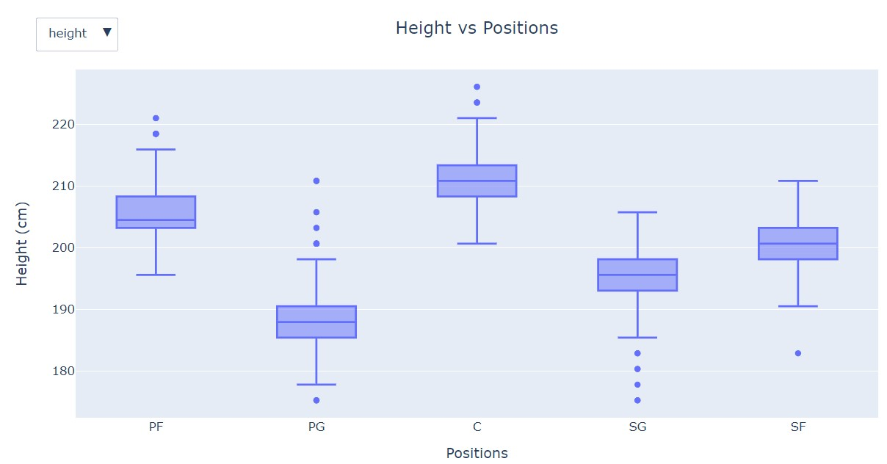
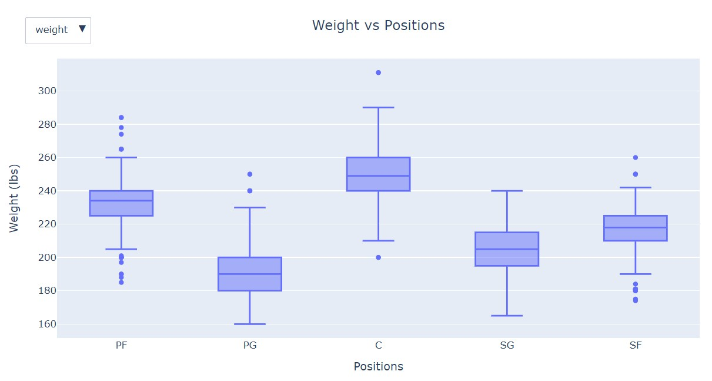
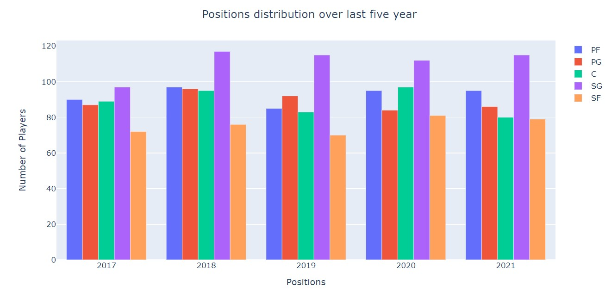
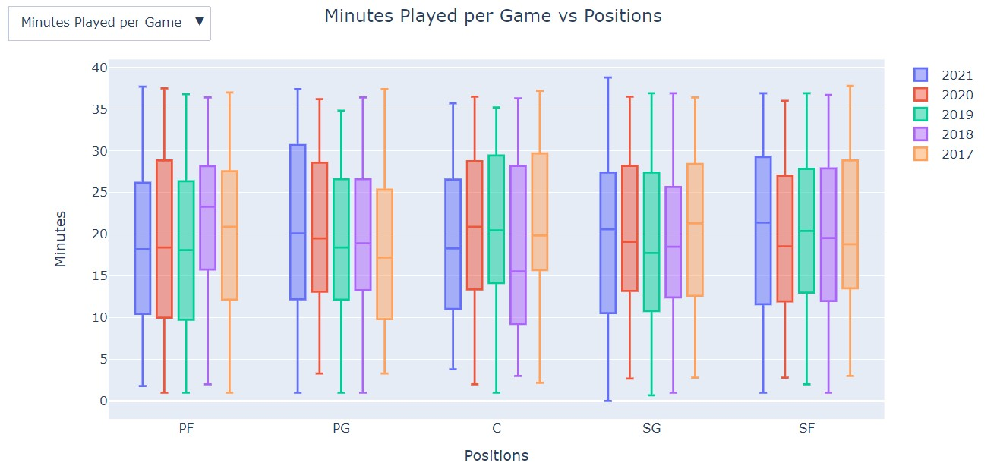
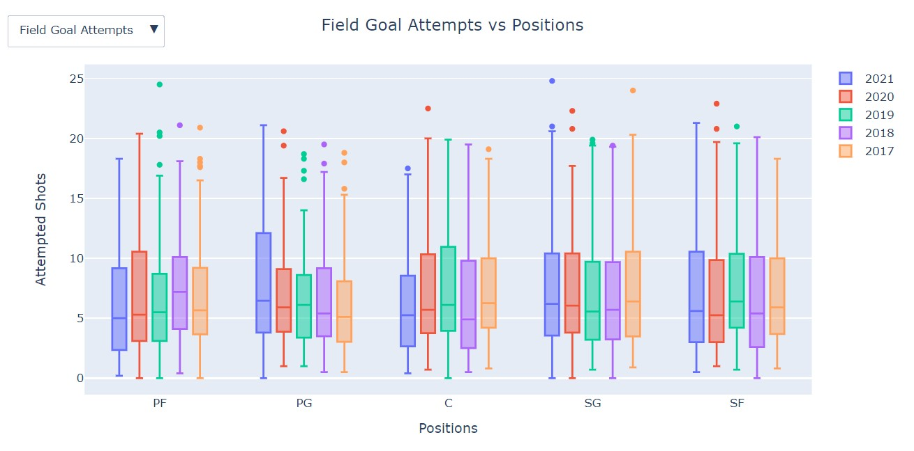
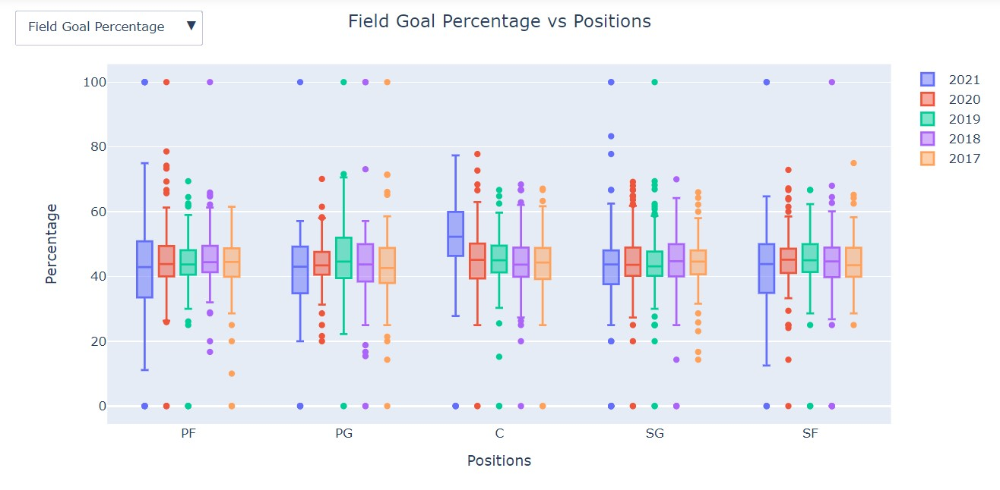
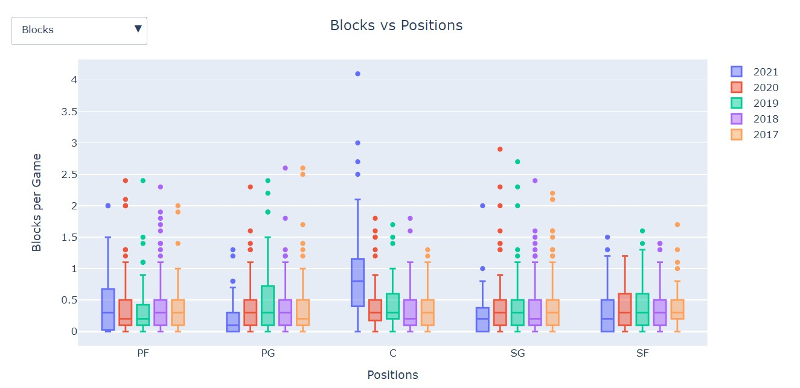
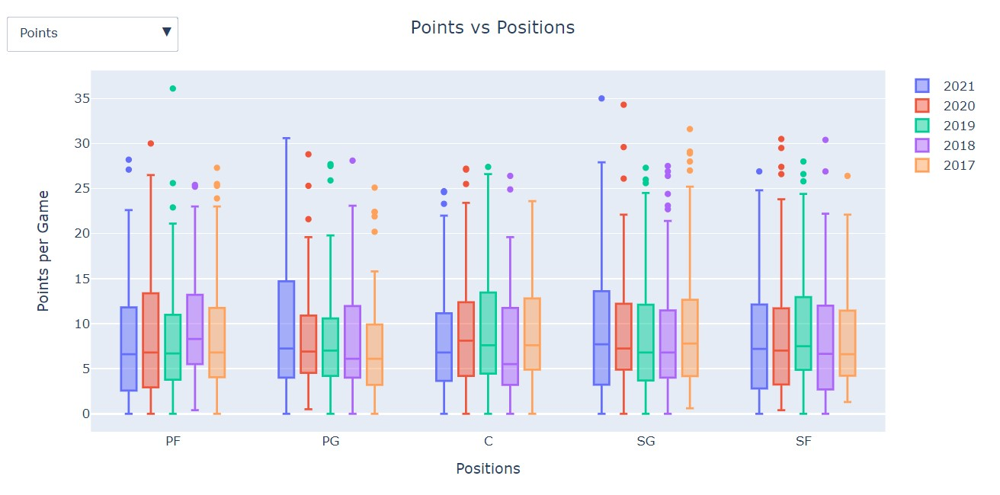
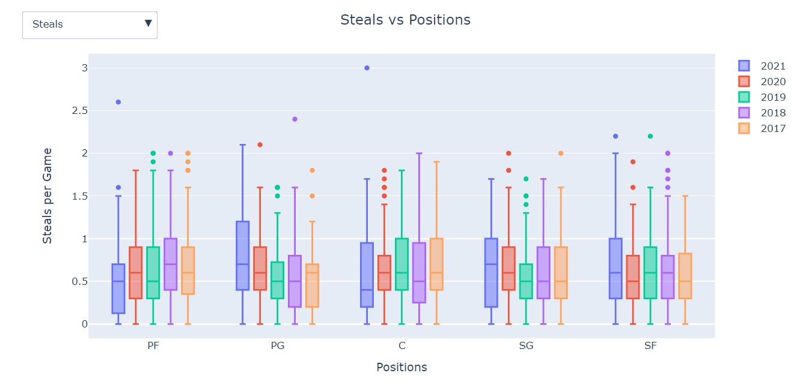
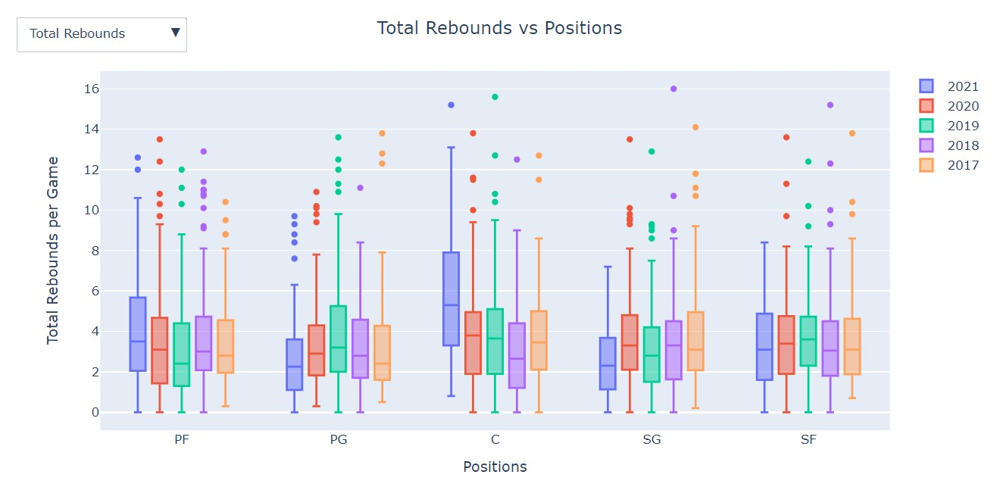

# NBA Positions Analysis

In this analysis, I focused on how each individual positions differ in their ingame play style. I also looked into how the characteristics of the player impact the position they play.

## Web Scraping

* Used BeautifulSoup to scrap players per-game stats from https://www.basketball-reference.com/leagues/NBA_2021_per_game.html
* Used Selenium to scrap height & weight of the players from https://www.nba.com/players

## Data Storing

* Stored data in a MySQL database
* Used PyMySQL as the connecter to MySQL

## Data Cleaning

* Converted missing percentages to zero percent
* Removed redundant data
* Combined the in-game data with the charateristic data
* Removed "lbs" in the weight column
* Converted height from feet-inches to centimeters

## Exploratory Data Analysis

In the analysis, I looked into a couple of things:
* The correlation of all the numerical variables
* How the characteristics of players in each position

  </img>
  </img>

* How are the positions distributed over the last five years
</img>

* Game participation of each position
</img>

* Shooting Attempts of each position
</img>

* Shooting Efficiency of each position
</img>

* Other relevant in-game stats of each position

  </img>
  </img>

  </img>
  </img>

## Learning

* Weight and height seems to impact the positions of the player, while the age doesn't.
* The number of Shooting Guards seems to increased for the past 5 years, while the other 4 positions fluctuate.
* There isn't a significant difference in the amount of game time from each position
* Surprisingly, there isn't a signicicant difference in the shooting attemps and shooting percentage between each position
* However, Shooting Guards tend to have more upper outlier 3-pointers
* Overall, there isn't a position that excel in certain area of the game for the majority of the players. However, each position contains outliers that excel in some areas.

## Flaw

At the time of the analysis is done, the 2020-2021 season have just started. Therefore, the data may not be a perfect indicator of that year.

## Used

* BeautifulSoup
* Numpy
* Pandas
* Plotly
* PyMySQL
* Selenium
* SQLAlchemy
